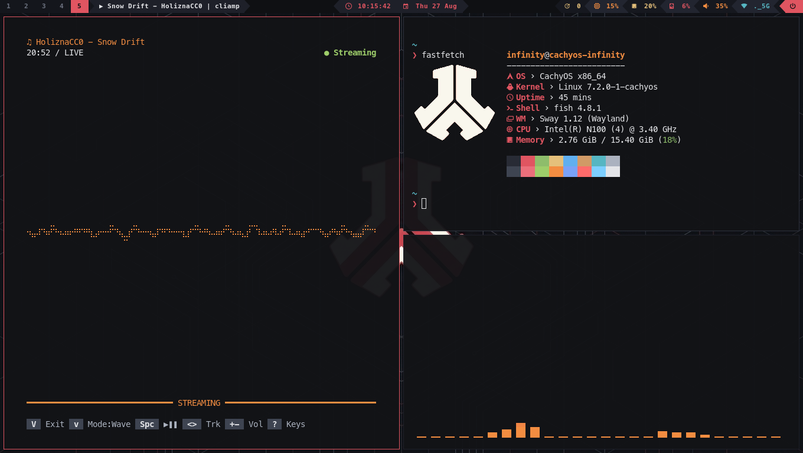

# 🛡️ Sway WM - Defqon.1 "Weekend Warrior" (Industrial Dark TUI)

```text
       ._____.     ._____.
      / _____|     |_____ \
     | /   | |     | |   \ |
     | |   | |  ^  | |   | |      DEFQON.1 • WEEKEND WARRIORS
     |_/  / /  / \  \ \  \_|      INDUSTRIAL HARDSTYLE DESKTOP
     /   / /  / ^ \  \ \   \      Sway WM • Wayland Native
    /   / /  / / \ \  \ \   \
   /   / /  / /   \ \  \ \   \
  /___/ /  / /     \ \  \ \___\
  \____/  /_/       \_\  \____/
```

<p align="center">
  
</p>

> Entorno de escritorio modular, ligero y de alto rendimiento para **Sway (Wayland)** con estética industrial inspirada en el festival de hardstyle **Defqon.1 ("Weekend Warriors")**, bordes afilados de 1px, paleta de colores balanceada (**Warrior Red** & **Amber Flame**), barra de estado continua **Powerline** y ecosistema orientado a herramientas de terminal (TUI).

---

## 🎨 Filosofía y Paleta de Colores

El diseño evita rojos fluorescentes saturados para prevenir fatiga visual durante sesiones prolongadas de programación y uso diario, combinando una base de asfalto/carbón profundo con acentos de escenario y láseres:

| Token Semántico | Código HEX | Rol en la Interfaz |
|---|---|---|
| **Asphalt Base** | `#121317` | Fondo principal de terminal Foot, ventanas y barra Waybar |
| **Surface Dark** | `#181a20` | Superficies de popups, menús Fuzzel, tarjetas y notificaciones |
| **Steel Border** | `#2d313d` | Bordes inactivos (1px), separadores y líneas de corte |
| **Warrior Red** | `#e05561` | Borde de ventana activa, prompt Starship, reloj y alertas |
| **Amber Flame** | `#f38d41` | CPU/RAM en Waybar, selección activa en menús y advertencias |
| **Hazard Gold** | `#e5c07b` | Métricas de memoria en btop, fecha y estado de paquetes |
| **Laser Green** | `#8ebd6b` | Estado de batería, cadenas de texto e indicadores de éxito |
| **Laser Cyan** | `#56b6c2` | Métricas de red Wi-Fi, clima en calendario y funciones |
| **Chalk White** | `#e4e5e8` | Texto principal de lectura con alto contraste y suavidad |

---

## 🚀 Características Principales

- **Arquitectura Modular de Sway:** Configuración dividida limpiamente en `config.d/*.conf` (variables, salidas, entradas, atajos, reglas, scratchpads, autostart, tema y barra).
- **Barra Superior Powerline Seamless:** Barra continua sin bordes redondeados ni gaps flotantes, interconectada con glifos Powerline reales (`` y ``) y módulos en tiempo real.
- **Fastfetch con Logo Gráfico en Sixel:** Logotipo oficial de Defqon.1 recortado en fondo transparente y renderizado en alta definición mediante gráficos Sixel nativos en Foot.
- **Scratchpads & Popups TUI Flotantes:** Ventanas emergentes centradas para control de volumen (`pulsemixer`), monitor del sistema (`btop`), selector de redes (`nmtui`), Git (`lazygit`), Bluetooth (`bluetui`), gestor de paquetes (`tui-packages`) y reloj/clima (`tui-calendar`).
- **Lanzadores Dinámicos con Fuzzel:** Menú de aplicaciones, selector de portapapeles (`cliphist`), menú de energía (`fuzzel-powermenu`) y selector interactivo de Wi-Fi (`fuzzel-wifi`).
- **Editor Helix & Multiplexor Zellij:** Temas dedicados `defqon1` diseñados a medida para resaltar código de forma clara y descansada.
- **Capturas Rápidas con Notificaciones:** Utilidad con `grim`, `slurp` y `wl-copy` que copia directamente al portapapeles con área de selección en rojo carmesí.

---

## 📂 Estructura del Repositorio

```text
dotfiles/
├── assets/
│   └── preview.png        # Captura de pantalla de presentación del escritorio
├── .config/
│   ├── btop/              # Monitor del sistema TUI (tema defqon1.theme)
│   ├── cava/              # Visualizador de audio (gradiente de fuego)
│   ├── environment.d/     # Variables de entorno para Wayland y temas oscuros
│   ├── fastfetch/         # Resumen del sistema con logo Defqon.1 en Sixel
│   ├── fish/              # Configuración de Fish Shell
│   ├── foot/              # Terminal Wayland con paleta Industrial Dark
│   ├── fuzzel/            # Lanzador de apps y menús dmenu
│   ├── gtk-3.0/ & gtk-4.0/# Configuración de temas GTK oscuros (adw-gtk3-dark)
│   ├── helix/             # Editor modal y tema defqon1.toml
│   ├── ly/                # Configuración estética de Ly Display Manager
│   ├── mako/              # Notificaciones ligeras con borde rojo
│   ├── micro/             # Editor Micro, bindings y esquemas
│   ├── qt5ct/ & qt6ct/    # Integración visual de aplicaciones Qt
│   ├── spotify-player/    # Reproductor TUI de Spotify
│   ├── starship.toml      # Prompt minimalista con paleta defqon1
│   ├── sway/              # Configuración principal modular de Sway
│   │   ├── config
│   │   ├── config.d/      # [01_variables, 02_outputs, 03_inputs, 04_keybindings...]
│   │   └── wallpapers/    # Fondo geométrico industrial e imágenes
│   ├── swaylock/          # Pantalla de bloqueo con anillo rojo y desenfoque
│   ├── waybar/            # Barra superior continua Powerline (config.jsonc + style.css)
│   ├── xsettingsd/        # Sincronización XWayland
│   ├── zellij/            # Multiplexor con tema defqon1
│   └── mimeapps.list      # Asociaciones por defecto
├── .local/
│   └── bin/               # Scripts y utilidades personalizadas
│       ├── check-updates     # Verificador JSON de actualizaciones para Waybar
│       ├── fuzzel-cliphist   # Historial del portapapeles interactivo
│       ├── fuzzel-powermenu  # Menú de apagado, reinicio, bloqueo y suspensión
│       ├── fuzzel-wifi       # Selector interactivo de redes Wi-Fi con NetworkManager
│       ├── screenshot-tool   # Utilidad de capturas con selección en rojo carmesí
│       ├── tui-calendar      # Reloj digital gigante, calendario y clima TUI
│       └── tui-packages      # Gestor interactivo de paquetes con FZF (Pacman + Yay)
├── home/
│   ├── .bashrc            # Configuración interactiva de Bash
│   ├── .zshrc             # Configuración interactiva de Zsh
│   └── .gtkrc-2.0         # Compatibilidad de tema GTK2
├── prompts/
│   └── wallpaper_prompts.md # Prompts de IA para generación de fondos
├── install.sh             # Script automatizado de instalación y enlaces simbólicos
├── .gitignore
├── LICENSE
└── README.md
```

---

## ⌨️ Atajos de Teclado (Keybindings)

> **Nota:** La tecla `$mod` corresponde a **Super / Windows**.

### 🚀 Lanzamiento de Aplicaciones y Menús
| Atajo | Acción |
|---|---|
| `$mod + Enter` | Abrir terminal (**Foot**) |
| `$mod + Space` / `$mod + d` | Abrir lanzador de aplicaciones (**Fuzzel**) |
| `$mod + v` | Historial del portapapeles (**Fuzzel + Cliphist**) |
| `$mod + y` | Explorador de archivos TUI (**Yazi**) |
| `$mod + Shift + f` | Explorador de archivos GUI (**Thunar**) |
| `$mod + Shift + e` | Menú de energía / sesión (**fuzzel-powermenu**) |
| `$mod + Esc` | Bloquear pantalla (**Swaylock**) |

### 🪟 Scratchpads y Ventanas Flotantes TUI
| Atajo | Herramienta / Pop-up |
|---|---|
| `$mod + m` | Mezclador de audio (**Pulsemixer**) |
| `$mod + Shift + b` | Monitor de recursos (**Btop**) |
| `$mod + Shift + n` | Configuración de red (**NMTUI**) |
| `$mod + Shift + w` | Selector rápido de Wi-Fi (**Fuzzel Wi-Fi**) |
| `$mod + Shift + g` | Interfaz Git (**Lazygit**) |
| `$mod + Shift + t` | Gestor Bluetooth (**Bluetui**) |
| `$mod + i` | Gestor de paquetes (**TUI Packages**) |
| `$mod + c` | Reloj, Calendario y Clima (**TUI Calendar**) |
| `$mod + Shift + Enter` | Terminal flotante scratchpad |
| `$mod + Shift + -` | Enviar ventana activa al scratchpad general |
| `$mod + -` | Alternar/Mostrar scratchpad general |

### 🧭 Navegación y Gestión de Ventanas
| Atajo | Acción |
|---|---|
| `$mod + [h/j/k/l]` o Flechas | Mover foco entre ventanas (Estilo Vim) |
| `$mod + Shift + [h/j/k/l]` | Mover ventana en la dirección indicada |
| `$mod + [1-9, 0]` | Cambiar al espacio de trabajo (Workspace) 1-10 |
| `$mod + Shift + [1-9, 0]` | Mover ventana al espacio de trabajo 1-10 |
| `$mod + f` | Alternar pantalla completa (Fullscreen) |
| `$mod + Shift + Space` | Alternar ventana flotante / tiling |
| `$mod + b` | División horizontal |
| `$mod + n` | División vertical |
| `$mod + s` | Layout en pila (*Stacking*) |
| `$mod + w` | Layout con pestañas (*Tabbed*) |
| `$mod + e` | Alternar división de layout |
| `$mod + r` | Entrar en modo redimensión (*Resize mode*) |
| `$mod + Shift + q` | Cerrar ventana enfocada |
| `$mod + Shift + c` | Recargar configuración de Sway al instante |

### 📸 Capturas de Pantalla
| Atajo | Tipo de Captura |
|---|---|
| `Print` | Captura de pantalla completa al portapapeles |
| `Shift + Print` o `$mod + Shift + s` | Selección de área interactiva con `slurp` |
| `$mod + Print` | Captura de la ventana activa enfocada |

### 🔊 Controles de Medios y Brillo
| Atajo | Acción |
|---|---|
| `XF86AudioMute` | Silenciar / Activar audio |
| `XF86AudioLowerVolume` | Bajar volumen (-5%) |
| `XF86AudioRaiseVolume` | Subir volumen (+5%) |
| `XF86AudioMicMute` | Silenciar / Activar micrófono |
| `XF86AudioPlay` / `Pause` | Reproducir / Pausar medios |
| `XF86AudioNext` / `Prev` | Siguiente / Anterior pista |
| `XF86MonBrightnessUp/Down` | Ajustar brillo de pantalla (+/- 5%) |

---

## 📦 Paquetes y Dependencias

Para instalar todas las dependencias en **Arch Linux** o **CachyOS**:

```bash
sudo pacman -S --needed \
    sway waybar fuzzel mako swaylock foot grim slurp wl-clipboard \
    cliphist playerctl brightnessctl libnotify polkit-gnome starship \
    btop helix micro zellij cava fastfetch fish yazi thunar \
    adw-gtk-theme papirus-icon-theme qt5ct qt6ct xsettingsd \
    ttf-meslo-nerd networkmanager pulsemixer imagemagick chafa
```

Y vía **AUR / Yay**:

```bash
yay -S --needed swaylock-effects bluetui lazygit spotify-player
```

---

## 🛠️ Instalación y Uso de Dotfiles

1. **Clonar este repositorio en tu directorio personal:**
   ```bash
   git clone <URL_DE_TU_REPOSITORIO> ~/dotfiles
   cd ~/dotfiles
   ```

2. **Ejecutar el script de instalación:**
   ```bash
   ./install.sh
   ```
   > El script creará enlaces simbólicos automáticos (`symlinks`) hacia `~/.config`, `~/.local/bin` y `~`, haciendo una copia de seguridad previa de cualquier configuración existente en `~/.dotfiles_backup/`.

3. **Recargar Sway:**
   Presiona `$mod + Shift + c` para aplicar todos los cambios inmediatamente.

---

## 📤 Cómo Subir este Repositorio a GitHub

1. Crea un repositorio vacío en [GitHub](https://github.com/new) con el nombre `defqon1-sway` (o el que prefieras).
2. En tu terminal ejecuta:

```bash
cd ~/dotfiles
git remote add origin git@github.com:InfinitySystemsM/weekend-warriors-dotfiles.git
git branch -M main
git push -u origin main
```

---

## 📄 Licencia

Distribuido bajo la Licencia MIT. Consulta el archivo [LICENSE](file:///home/infinity/dotfiles/LICENSE) para más información.
